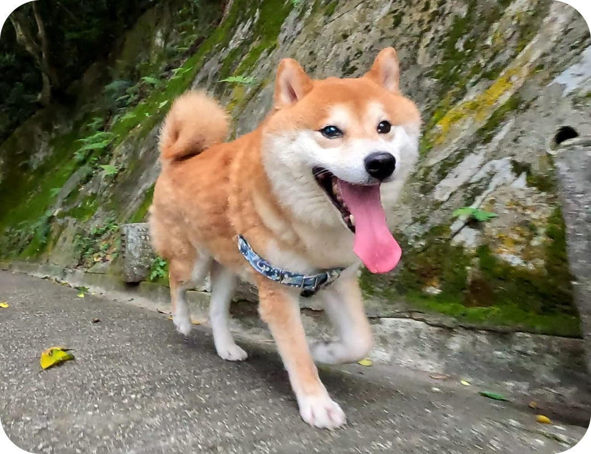

### Hi there 👋

### ✨ Open-Source Project

Here are some of my open-source projects. If you find my work interesting or useful, please consider giving them a ⭐️star. Thank you!

-   📡 **[live-streaming-server-net](https://github.com/josephnhtam/live-streaming-server-net)**: An RTMP live streaming server built with .NET.
-   🎥 **[vsp-youtube-clone-microservices](https://github.com/josephnhtam/vsp-youtube-clone-microservices)**: A YouTube clone application with microservices architecture.
-   🤖 **[deep-agent-net](https://github.com/josephnhtam/deep-agent-net)**: A ready-to-run agent harness for building autonomous agents with .NET.
